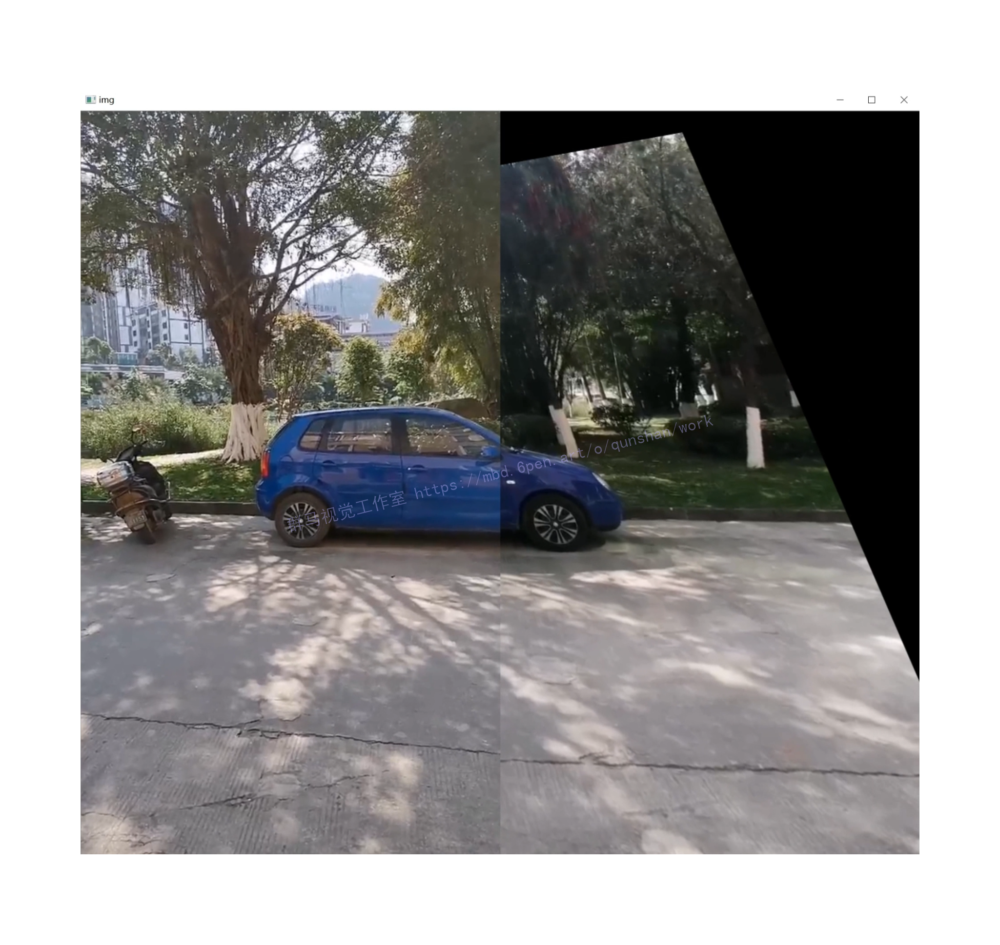
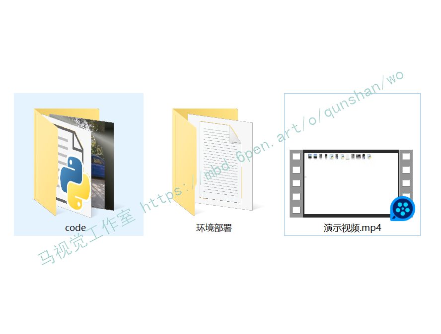

# 1.双视频拼接效果展示



# 2.视频演示
[[项目分享]Python基于OpenCV＆ORB和特征匹配的双视频图像拼接（源码＆部署教程）_哔哩哔哩_bilibili](https://www.bilibili.com/video/BV1oD4y1i7te/?vd_source=bc9aec86d164b67a7004b996143742dc)

# 3.背景
随着汽车电子和人工智能的快速发展，智能连接汽车也迎来了全面发展的黄金时代[1-5]。中央ADAS利用安装在车辆上的传感器、激光雷达和毫米波雷达实时检测车辆周围环境，补充障碍物检测和全景生成等功能，为驾驶员提供实时警报，提高行车安全性。在目前众多互联网公司参与的同时，传统汽车行业投入了相当大的资金用于辅助驾驶系统的研发[6]。
除了技术创新和业务投资外，日益增长的安全驾驶需求有助于辅助作业的快速发展[7,8]。据公安部门公布的数据显示，2018年我国汽车保有量已达2.5亿辆，并继续快速增长[9,10]。这类车辆的数量导致道路交通、污染和道路交通事故的增加。其中，交通事故频发、伤势严重是最严重的问题。主观原因是造成事故的主要原因是驾驶员在驾驶过程中存在视觉致命角度，难以恰当地确定车身周围的环境信息[11-15]。近年来，图像相关的驾驶辅助装置、雷达等设备被广泛应用于汽车安全系统中，以降低交通事故率。
辅助系统利用两个摄像机实时采集车辆周围的图像信息，利用图像拼接技术合成全景图像。本系统极大地消除了驾驶员的视觉死角，保证了行车安全。其中，图像贴片技术是系统的中心，是计算机视觉、图形成像、数字优化等交叉学科研究的对象[16]。近年来，在CVPR、ECCV和计算机图形学专业组等高级别会议上取得了许多成果。这种技术不仅对驱动支撑大有裨益，而且在科学研究中具有学术价值。本文重点研究SIFT拼接算法。对算法进行了优化和改进，提高了整体效率和实用性。
# 4.研究意义
图片的全景拼接如今已不再稀奇，现在的智能摄像机和手机摄像头基本都带有图片自动全景拼接的功能，但是一般都会要求拍摄者保持设备的平稳以及单方向的移动取景以实现较好的拼接结果。这是因为拼接的图片之间必须要有相似的区域以保证拼接结果的准确性和完整性。本文主要简单描述如何用 Python 和 OpenCV 库实现两张图片的自动拼合。
# 5. 研究内容
#### 为什么引入ORB
嗯，跟Harris一样，如果你运行过SIFT，也一定有所感悟。即便它集尺度不变、旋转不变、光变不敏感等优点于一身，但是它运行实在是慢了点。

那么改善SIFT，从SURF开始，大家的重点都是集中在速度优化上。据论文中提供，ORB要比SIFT快两个数量级！

这么厉害，我们先了解一下啥是ORB。

#### 什么是ORB
ORB（Oriented FAST and Rotated BRIEF）是Oriented FAST + Rotated BRIEF的缩写（感觉应该叫OFRB）。是目前最快速稳定的特征点检测和提取算法，许多图像拼接和目标追踪技术利用ORB特征进行实现。

当然，没看懂不要紧，先记住我们的初衷：

首先要实现目标检测的功能；
其次在不牺牲性能的代价下提高速度；
最后，开源无专利；
大神们在ORB上都做到了！

#### 怎么实现ORB
要了解ORB，如果直接去看他们的[博客](https://mbd.pub/o/bread/Y5WYk5Zv)，感觉多半会蒙圈。那是写给学术圈有一定基础的人看的。我等工程狗要了解ORB用简单的公式就可以：

ORB = Oriented FAST（特征点） + Rotated BRIEF（特征描述）

弗洛伊德说：一个问题搞不定，就拆成两个小问题，这样我们就有了两个搞不定的问题。

我们再来分别了解一下什么是FAST，为什么叫 Oriented FAST；什么是什么是BRIEF，为什么叫Rotated BRIEF。


# 6.特征匹配
特征匹配是计算机视觉中许多应用的基础，如图像匹配、摄像机跟踪、三维重建、物体识别，以及人脸识别等，因此，对这一概念的深入理解还不是太多的时间。本文希望以通俗易懂的方式来阐述特征匹配的过程以及在此过程中出现的一些问题。
#### ORB双视频拼接代码实现
计算机视觉市场巨大且不断增长，在这方面没有标准的API。今天的计算机视觉软件大约有三种：
 1 .研究代码( 缓慢、不稳定、独立和与其他图书馆不兼容 )。
 2 .昂贵的商业工具( 像 Halcon , matlab + Simulink )
 3 .一些具体的基于硬件的解决方案( 如视频监控、制造控制、医疗设备等 )是目前的现状，标准的API将简化计算机视觉程序和解决方案的开发。Opencv被确定成为这样一个标准的API。
[参考该博客提出的方案可以实时应用](https://afdian.net/item?plan_id=b6aa2352616511ed94fa52540025c377)。它的执行速度通过优化的C代码编写得到了明显的提高，通过购买Intel的IPP高性能多媒体库可以实现更快的处理速度。图1显示了OpenCV与其他主流视觉函数库的性能比较。
```
import cv2 as cv

def ORB_Feature(img1, img2):

    # 初始化ORB
    orb = cv.ORB_create()

    # 寻找关键点
    kp1 = orb.detect(img1)
    kp2 = orb.detect(img2)

    # 计算描述符
    kp1, des1 = orb.compute(img1, kp1)
    kp2, des2 = orb.compute(img2, kp2)

    # 画出关键点
    outimg1 = cv.drawKeypoints(img1, keypoints=kp1, outImage=None)
    outimg2 = cv.drawKeypoints(img2, keypoints=kp2, outImage=None)
	
	# 显示关键点
    # import numpy as np
    # outimg3 = np.hstack([outimg1, outimg2])
    # cv.imshow("Key Points", outimg3)
    # cv.waitKey(0)

    # 初始化 BFMatcher
    bf = cv.BFMatcher(cv.NORM_HAMMING)

    # 对描述子进行匹配
    matches = bf.match(des1, des2)

    # 计算最大距离和最小距离
    min_distance = matches[0].distance
    max_distance = matches[0].distance
    for x in matches:
        if x.distance < min_distance:
            min_distance = x.distance
        if x.distance > max_distance:
            max_distance = x.distance

    # 筛选匹配点
    '''
        当描述子之间的距离大于两倍的最小距离时，认为匹配有误。
        但有时候最小距离会非常小，所以设置一个经验值30作为下限。
    '''
    good_match = []
    for x in matches:
        if x.distance <= max(2 * min_distance, 30):
            good_match.append(x)

    # 绘制匹配结果
    draw_match(img1, img2, kp1, kp2, good_match)

def draw_match(img1, img2, kp1, kp2, match):
    outimage = cv.drawMatches(img1, kp1, img2, kp2, match, outImg=None)
    cv.imshow("Match Result", outimage)
    cv.waitKey(0)

if __name__ == '__main__':
    # 读取图片
    image1 = cv.imread('1.png')
    image2 = cv.imread('2.png')
    ORB_Feature(image1, image2)

```

# 7.系统整合
下图[完整源码＆环境部署视频教程](https://s.xiaocichang.com/s/e05ab4)


参考博客[《Python基于OpenCV＆ORB和特征匹配的双视频图像拼接（源码＆部署教程）》](https://mbd.pub/o/qunma/work)

# 8.参考文献
| 1 | 王国东;文鹏程;程岳;;[一种利用ORB特征进行航拍图像拼接的方法](http://www.cnki.com.cn/Article/CJFDTOTAL-NMSB201404008.htm)[J];内蒙古师范大学学报(自然科学汉文版);2014年04期 |
| 2 | 李玮琳;;[基于改进ORB算法的图像配准方法研究](http://www.cnki.com.cn/Article/CJFDTOTAL-HBYD202006019.htm)[J];信息通信;2020年06期 |
| 3 | 雍玖;王阳萍;雷晓妹;王松;;[基于改进ORB特征检测的全景视频拼接](http://www.cnki.com.cn/Article/CJFDTOTAL-JYRJ201705032.htm)[J];计算机应用与软件;2017年05期 |
| 4 | 刘永;王贵锦;姚安邦;汪浩;林行刚;;[基于自适应帧采样的视频拼接](http://www.cnki.com.cn/Article/CJFDTOTAL-QHXB201001026.htm)[J];清华大学学报(自然科学版);2010年01期 |
| 5 | 张盟;王志亮;刘汉忠;;[基于ORB特征的图像误匹配剔除算法研究](http://www.cnki.com.cn/Article/CJFDTOTAL-NJGC202101005.htm)[J];南京工程学院学报(自然科学版);2021年01期 |
| 6 | 黄丽;李晓明;;[基于ORB特征的图像误匹配剔除方法研究](http://www.cnki.com.cn/Article/CJFDTOTAL-JDGC201705025.htm)[J];机电工程;2017年05期 |
| 7 | 郑现;申萍;邱霁;夏顺盈;;[视频拼接技术在列车安全监控中的应用](http://www.cnki.com.cn/Article/CJFDTOTAL-JCDC201805018.htm)[J];机车电传动;2018年05期 |
| 8 | 钟华民;王伟;张慧华;;[结合ORB特征和色彩模型的视觉跟踪算法](http://www.cnki.com.cn/Article/CJFDTOTAL-MSSB201501012.htm)[J];模式识别与人工智能;2015年01期 |
| 9 | 王文爽;孙伟;王帅;;[基于改进ORB的警用无人机图像配准方法](http://www.cnki.com.cn/Article/CJFDTOTAL-SJSJ201901031.htm)[J];计算机工程与设计;2019年01期 |
| 10 | 薛建江,李真;[通过防火墙的ORB互操作探讨](http://www.cnki.com.cn/Article/CJFDTOTAL-JSYJ200205017.htm)[J];计算机应用研究;2002年05期 |
| 11 | 李双全;章国宝;;[基于ORB算法的双目立体视觉测距系统](http://www.cnki.com.cn/Article/CJFDTOTAL-GYKJ201706018.htm)[J];工业控制计算机;2017年06期 |
| 12 | 王天也;王绍举;;[一种基于ORB特征的夜晚图像拼接方法](http://www.cnki.com.cn/Article/CJFDTOTAL-JSJZ202105094.htm)[J];计算机仿真;2021年05期 |
| 13 | 戴雪梅;郎朗;陈孟元;;[基于改进ORB的图像特征点匹配研究](http://www.cnki.com.cn/Article/CJFDTOTAL-DZIY201602009.htm)[J];电子测量与仪器学报;2016年02期 |
| 14 | 曾世聪;郭太良;林志贤;;[基于ORB和角点方向夹角约束的快速图像配准方法](http://www.cnki.com.cn/Article/CJFDTOTAL-DSSS201509020.htm)[J];电视技术;2015年09期 |
| 15 | 陈静;冯桂兰;吕昌亮;康宇;;[双处理器实时视频拼接系统](http://www.cnki.com.cn/Article/CJFDTOTAL-ZGJL201602019.htm)[J];中国计量学院学报;2016年02期 |
| 16 | 邢凯盛;凌有铸;陈孟元;;[ORB特征匹配的误匹配点剔除算法研究](http://www.cnki.com.cn/Article/CJFDTOTAL-DZIY201608020.htm)[J];电子测量与仪器学报;2016年08期 |
| 17 | 林财明;卫志敏;;[特定场景大视角视频拼接技术研究与实现](http://www.cnki.com.cn/Article/CJFDTOTAL-GZDN201704009.htm)[J];电脑与电信;2017年04期 |

 |


---
#### 如果您需要更详细的【源码和环境部署教程】，除了通过【系统整合】小节的链接获取之外，还可以通过邮箱以下途径获取:
#### 1.请先在GitHub上为该项目点赞（Star），编辑一封邮件，附上点赞的截图、项目的中文描述概述（About）以及您的用途需求，发送到我们的邮箱
#### sharecode@yeah.net
#### 2.我们收到邮件后会定期根据邮件的接收顺序将【完整源码和环境部署教程】发送到您的邮箱。
#### 【免责声明】本文来源于用户投稿，如果侵犯任何第三方的合法权益，可通过邮箱联系删除。